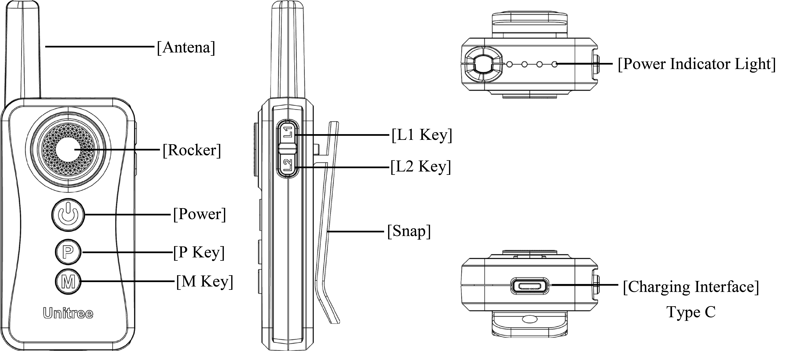

# Getting Started

## Create a new virtual env in .venv
```bash
python3 -m venv .venv
```

## Activate venv
```bash
source .venv/bin/activate
```
## Install cyclonedds
Follow the instructions in the [Cyclone DDS repository](https://cyclonedds.io/docs/cyclonedds/latest/installation/installation.html).

> [!IMPORTANT]  
> Make sure that cyclonedds core 0.10.2 is installed (e.g. git checkout 0.10.2)

## Install dependencies
```bash
python -m pip install --upgrade pip
pip install -r requirements.txt
```

## Install the Unitree Go2 SDK
Follow the instructions in the [Unitree Go2 SDK repository](https://github.com/unitreerobotics/unitree_sdk2_python?tab=readme-ov-file#installing-from-source).

# Usage

## Run the program
```bash
python src/main.py
```

## UWB Controller
At any point during the execution of the program, you can take priority control of the robot by using the UWB controller.<br>
While the UWB is used, the program will not send any command.<br>
If the UWB is released, the program will resume control of the robot.<br>

<br>

Use the joystick (`Rocker`) to move the robot around.<br>
Press `L2` twice to activate the obstacle avoidance mode.<br>
Press `L2` three times to disable the obstacle avoidance mode.<br>

### Emergency Stop
Press the `M` button on the UWB or the `Spacebar` on the computer to do an emergency stop.<br>
This will disable all motors and the robot will fall to the ground.<br>
The program will also enter a disabled state.<br>

If the joystick is used again, the robot will regain control but the program will remain disabled.<br>
To re-enable the program, press the `Enter` button.

## Safe mode
By default, the program runs in safe mode.<br>
In this mode the robot will not perform any actions that would make sudden moves like a side flip or jump forward.<br>
To toggle safe mode, press the `Ctrl` key.<br>

## Index finger control
By default, the index finger control is disabled.<br>
To toggle it, press the `Shift` key.<br>
TODO: Explain index finger control.

## Exit the program
To exit the program, press the `Esc` key.<br>

## Recognized gestures

Each gesture corresponds to a specific command for the robot.<br>
If the corresponding key is pressed, the robot will also perform the associated action.<br>

```
a, hand_heart, hand_heart2 -> Heart
s, holy (hands together) -> Scrape (chinese greet)
d, palm (open fingers) -> Hello (wave hand)
f, stop (palm closed fingers) -> StandDown
g, fist -> Sit
h, peace (V sign) -> Content
j, like -> WalkUpright
k, dislike -> HandStand
l, three_gun -> LeftFlip
w, e, rock -> dance1, dance2
r, middle_finger -> pounce
t, peace_inverted -> jump_forward
z, grabbing -> stretch
```